# 🛡️ BSCC: BP3MI Security Command Centre

## Ringkasan Eksekutif
**BP3MI Security Command Centre (BSCC)** adalah infrastruktur keamanan siber kelas enterprise yang terintegrasi secara *native* ke dalam ekosistem **Jariklurik**. Sistem ini tidak hanya berfungsi sebagai tameng (firewall), tetapi juga sebagai pusat intelijen yang memantau, mendeteksi, dan merespons setiap anomali lalu lintas secara otomatis.

Dokumen ini merupakan panduan teknis operasional yang membedah logika internal (code-to-code) dari setiap modul BSCC.

---

## 🔄 Alur Kerja Data (Enterprise Data Flow)
Lalu lintas data melalui pemeriksaan tujuh lapis sebelum dianggap sah oleh server.

```mermaid
graph TD
    A["🌐 Incoming Request"] --> B{"🛡️ Layer 1: IP Warden"}
    B -- "Blocked" --> C["🚫 Termination (403)"]
    B -- "Allowed" --> D{"🛡️ Layer 2: Rate Limiter"}
    D -- "Flood Detected" --> E["⏳ Throttle (429)"]
    D -- "Safe" --> F{"🛡️ Layer 3: Shield (WAF)"}
    F -- "Pattern Match" --> G["🚨 Incident Trigger"]
    G -- "Severity: Critical" --> H["🔒 Auto-IP Block"]
    F -- "Clean" --> I["🚀 App Controller"]
    I -- "Processing..." --> J["📈 Layer 4: Vision (Tracker)"]
    J --> K[("💾 Storage: Public Stats")]
    I --> L["🏁 Final Response"]
```



---

## 🏛️ Bedah Kode Modul Primer

### 1. 🛠️ BSCC Shield: Analisis Payload Heuristik
Modul ini bekerja di `app/Libraries/SecurityEngine.php` dengan metode pemindaian rekursif pada struktur array input.

#### Bedah Kode: Normalisasi Defansif
Pencegahan serangan berbasis encoding dilakukan dengan normalisasi mendalam:
```php
public function analyzeInput(string $input, string $context = 'all'): ?array
{
    // Normalisasi: Decode URL-encoded string & konversi ke Huruf Kecil
    // Hal ini mencegah bypass seperti: <ScRiPt> atau %3cscript%3e
    $input = strtolower(urldecode($input)); 

    if ($context === 'all' || $context === 'sql') {
        foreach ($this->sqliPatterns as $pattern) {
            // Penggunaan flag /i pada preg_match sebagai proteksi ganda
            if (preg_match('/' . $pattern . '/i', $input)) {
                return ['type' => 'SQL Injection', 'pattern' => $pattern];
            }
        }
    }
    // ...
}
```

---

### 2. 🧬 BSCC Probe: Forensik Digital & Anti-VPN
Probe menggunakan teknik *Fingerprinting* yang tidak bergantung pada Cookies atau IP, sehingga tetap dapat melacak pelaku yang menggunakan VPN atau Proxy.

#### Bedah Kode: Kalkulasi Device Hash
Informasi perangkat digabungkan menjadi satu identitas unik (Seed).
```php
// app/Controllers/Api/ForensicsController.php
$fingerprintSource = ($data['canvas_hash'] ?? '') . 
                     json_encode($data['webgl'] ?? []) . 
                     json_encode($data['screen'] ?? []) .
                     ($data['timezone'] ?? '');

// SHA256 menjamin integritas ID Perangkat yang tidak bisa dimanipulasi dengan mudah
$deviceHash = hash('sha256', $fingerprintSource);
```

---

### 🚀 Studi Kasus: Perbaikan Kritis Visitor Tracking (19 Januari 2026)

Hari ini kita melakukan perbaikan pada modul **BSCC Vision** yang sebelumnya gagal mencatat kunjungan. Berikut adalah bedah perbaikannya:

#### A. Masalah Case-Sensitivity pada Filter
**Sebelumnya**: Filter gagal karena CI4 terkadang mengembalikan metode request dalam huruf besar ("GET"), sedangkan kode mengecek huruf kecil.
```php
// LAMA (Gagal mendeteksi "GET")
if ($request->getMethod() !== 'get') 

// BARU (Pasti Lolos)
if (strtolower($request->getMethod()) !== 'get')
```

#### B. Masalah Keamanan Layer Model
**Masalah**: Eloquent-style model di CI4 memblokir field `page_url` karena tidak terdaftar di daftar putih keamanan.
```php
// app/Models/WebVisitorModel.php
// Menambahkan field kritis ke daftar putih agar bisa disimpan ke DB
protected $allowedFields = [
    'ip_address', 'user_agent', 'page_url', 'last_activity'
];
```

#### C. Stabilisasi Output API
**Masalah**: `preload.php` melakukan `echo` metadata yang menginterupsi streaming data JSON pada Dashboard.
```php
// preload.php
// Silencing debug output untuk mencegah korupsi header HTTP
// echo 'Loaded: ' . $file[0]; // DIMATIKAN
```

---

## 🖥️ Logika Dashboard Command Centre
Integrasi statistik keamanan diproses melalui `SecurityController.php` dengan query agregasi tinggi.

#### Query Agregasi Traffic 24 Jam
```sql
SELECT 
    DATE_FORMAT(created_at, '%H:00') as time_slot,
    COUNT(*) as count,
    SUM(CASE WHEN status_code = 403 THEN 1 ELSE 0 END) as blocked
FROM security_logs
WHERE created_at >= DATE_SUB(NOW(), INTERVAL 24 HOUR)
GROUP BY DATE_FORMAT(created_at, '%H:00')
```
Logika ini memungkinkan Admin melihat pola serangan berdasarkan jam (misal: Serangan naik pada pukul 03:00 dini hari).

---

## 🛡️ Panduan Keamanan untuk Tim Pengembang
*   **Zero-Trust Input**: Jangan pernah mempercayai input dari `$_GET` atau `$_POST` secara langsung tanpa melalui `SecurityEngine`.
*   **Header Guard**: Selalu periksa `User-Agent` untuk memblokir script otomatis (Python-requests, Go-http-client) yang tidak sah.
*   **DB Optimization**: Karena tabel `security_logs` mencatat setiap request, lakukan pembersihan (archiving) setiap 30 hari untuk menjaga performa.

---
> [!CAUTION]
> Mematikan Filter `SecurityMonitor` di `app/Config/Filters.php` akan mengekspos seluruh infrastruktur terhadap serangan injeksi langsung. **Jangan lakukan ini di lingkungan produksi.**
